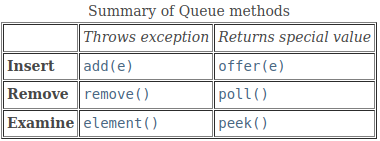

# 2. Queue

### Overview

- Another fundamental data structure is the queue. It is a close “cousin” of the stack, but a queue is a collection of objects that are inserted and removed according to the first-in, first-out (FIFO) principle.


### Interface `java.util.Queue<E>`

| **Modifier and Type** | **Method**   | **Description**                                              |
| --------------------- | ------------ | ------------------------------------------------------------ |
| `boolean`             | `add(E e)`   | Inserts the specified element into this queue if space is available, returning true upon success. Throws IllegalStateException if no space is available. |
| `boolean`             | `offer(E e)` | Inserts the specified element into this queue if space is available, returning true upon success. |
| `E`                   | `element()`  | Retrieves, but does not remove, the head of this queue.      |
| `E`                   | `peek()`     | Retrieves, but does not remove, the head of this queue. Returns null if the queue is empty. |
| `E`                   | `poll()`     | Retrieves and removes the head of this queue. Returns null if the queue is empty. |
| `E`                   | `remove()`   | Retrieves and removes the head of this queue. Throws NoSuchElementException if the queue is empty. |




## Implementation

### Circular Array-Based Queue

```java
package datastructures.queue;

import java.util.AbstractQueue;
import java.util.Iterator;
import java.util.NoSuchElementException;
import java.util.Queue;

/** Implements the Queue interface using a circular array. */
public class ArrayQueue<E> extends AbstractQueue<E> implements Queue<E> {
    // Data Fields
    /** Index of the front of the queue. */
    private int front;
    /** Index of the rear of the queue. */
    private int rear;
    /** Current size of the queue. */
    private int size;
    /** Current capacity of the queue. */
    private int capacity;
    /** Default capacity of the queue. */
    private static final int DEFAULT_CAPACITY = 10;
    /** Array to hold the data. */
    private E[] data;

    // Constructors
    /** Construct a queue with the default initial capacity. */
    public ArrayQueue() {
        this(DEFAULT_CAPACITY);
    }

    @SuppressWarnings("unchecked")
    /** Construct a queue with the specified initial capacity.
    @param initCapacity The initial capacity
    */
    public ArrayQueue(int initCapacity) {
        capacity = initCapacity;
        data = (E[]) new Object[capacity];
        front = 0;
        rear = capacity-1;
        size = 0;
    }

    // Public Methods
    /** Inserts an item at the rear of the queue.
     @post item is added to the rear of the queue.
     @param item The element to add
     @return true (always successful)
     */
    @Override
    public boolean offer(E item) {
        if (size == capacity) {
            reallocate();
        }
        size++;
        rear = (rear + 1) % capacity; data[rear] = item;
        return true;
    }

    /** Returns the item at the front of the queue without removing it.
     @return The item at the front of the queue if successful; return null if
     the queue is empty
     */
    @Override
    public E peek() {
        if (size == 0)
            return null;
        else
            return data[front];
    }

    /** Removes the entry at the front of the queue and returns it if the queue is
     not empty.
     @post front references item that was second in the queue.
     @return The item removed if successful or null if not
     */
    @Override
    public E poll() {
        if (size == 0) {
            return null;
        }
        E result = data[front];
        front = (front + 1) % capacity;
        size--;
        return result;
    }

    @Override
    public boolean add(E e) {
        return offer(e);
    }

    @Override
    public E element() {
        return peek();
    }

    @Override
    public E remove() {
        return poll();
    }

    @Override
    public Iterator<E> iterator() {
        return new ArrayQueueIterator();
    }

    @Override
    public int size() {
        return size;
    }

    // Private Methods
    /** Double the capacity and reallocate the data.
     @pre The array is filled to capacity.
     @post The capacity is doubled and the first half of the expanded array is
     filled with data.
     */
    @SuppressWarnings("unchecked")
    private void reallocate() {
        int newCapacity = 2 * capacity;
        E[] newData = (E[]) new Object[newCapacity];
        int j = front;
        for (int i = 0; i < size; i++) {
            newData[i] = data[j];
            j = (j + 1) % capacity;
        }
        front = 0;
        rear = size-1;
        capacity = newCapacity;
        data = newData;
    }

    /** Inner class to implement the Iterator<E> interface. */
    private class ArrayQueueIterator implements Iterator<E> {
        // Data Fields
        // Index of next element
        private int index;
        // Count of elements accessed so far
        private int count = 0;

        // Methods

        // Constructor
        /** Initializes the Iter object to reference the first queue element. */
        public ArrayQueueIterator() {
            index = front;
        }
        /** Returns true if there are more elements in the queue to access. */
        @Override
        public boolean hasNext() {
            return count < size;
        }

        /** Returns the next element in the queue.
         @pre index references the next element to access.
         @post index and count are incremented.
         @return The element with subscript index
         */
        @Override
        public E next() {
            if (!hasNext()) {
                throw new NoSuchElementException();
            }
            E returnValue = data[index];
            index = (index + 1) % capacity;
            count++;
            return returnValue;
        }

        /** Remove the item accessed by the Iter object – not implemented. */
        @Override
        public void remove() {
            throw new UnsupportedOperationException();
        }
    }
}
```


#### Increasing Queue Capacity

- When the capacity is reached, we double the capacity and copy the array into the new one, as was done for the ArrayList. However, we can’t simply use the reallocate method we developed for the ArrayList because of the circular nature of the array. We can’t copy over elements from the original array to the first half of the expanded array, maintaining their position.
- We must first copy the elements from position front through the end of the original array to the beginning of the expanded array; then copy the elements from the beginning of the original array through rear to follow those in the expanded array.


### Single-Linked List-Based Queue

```java
package datastructures.queue;

import java.util.*;

/** Implements the Queue interface using a single‐linked list. */
public class ListQueue<E> extends AbstractQueue<E> implements Queue<E> {

    /** A Node is the building block for a single‐linked list. */
    private static class Node<E> {
        // Data Fields
        /** The reference to the data. */
        private E data;
        /** The reference to the next node. */
        private Node<E> next;

        // Constructors
        /** Creates a new node with a null next field.
         @param dataItem The data stored
         */
        private Node(E dataItem) {
            data = dataItem;
            next = null;
        }

        /** Creates a new node that references another node.
         @param dataItem The data stored
         @param nodeRef The node referenced by new node
         */
        private Node(E dataItem, Node<E> nodeRef) {
            data = dataItem;
            next = nodeRef;
        }
    }

    // Data Fields
    /** Reference to front of queue. */
    private Node<E> front;
    /** Reference to rear of queue. */
    private Node<E> rear;
    /** Size of queue. */
    private int size;

    // Insert inner class Node<E> for single‐linked list here.
    // (See Listing 2.1.)

    // Methods

    /** Insert an item at the rear of the queue.
     @post item is added to the rear of the queue.
     @param item The element to add
     @return true (always successful)
     */
    @Override
    public boolean offer(E item) {
        // Check for empty queue.
        if (front == null) {
            rear = new Node<>(item);
            front = rear;
        } else {
        // Allocate a new node at end, store item in it, and
        // link it to old end of queue.
            rear.next = new Node<>(item);
            rear = rear.next;
        }
        size++;
        return true;
    }

    /** Remove the entry at the front of the queue and return it
         if the queue is not empty.
        @post front references item that was second in the queue.
        @return The item removed if successful, or null if not
     */

    @Override
    public E poll() {
        E item = peek();
        // Retrieve item at front.
        if (item == null)
            return null;
        // Remove item at front.
        front = front.next; size--;
        return item;
        // Return data at front of queue.
    }

    /** Return the item at the front of the queue without removing it.
     @return The item at the front of the queue if successful;
     return null if the queue is empty
     */
    @Override
    public E peek() {
        if (size == 0)
            return null;
        else
            return front.data;
    }

    @Override
    public boolean add(E e) {
        return offer(e);
    }

    @Override
    public E element() {
        return peek();
    }

    @Override
    public E remove() {
        return poll();
    }

    // Insert class Iter.

    @Override
    public Iterator<E> iterator() {
        return null;
    }

    @Override
    public int size() {
        return size;
    }
}
```


### Double-Linked List-Based Queue

- Use `java.util.LinkedList` class as adapter class.


```java
public class DoubleLinkedQueue<E> extends AbstractQueue<E> implements Queue<E> {

    private LinkedList<E> list; // an empty list

    public DoubleLinkedQueue( ) {
        list = new LinkedList<>();
    }

    @Override
    public boolean add(E e) {
        return list.add(e); // Appends e to the end of the list
    }

    @Override
    public boolean offer(E e) {
        return list.add(e); // Appends e to the end of the list
    }

    @Override
    public E remove() {
        return list.remove(); // Removes the element in the beginning of the list
    }

    @Override
    public E poll() {
        return list.remove();
    }

    @Override
    public E element() {
        return list.getFirst();
    }

    @Override
    public E peek() {
        return list.getFirst();
    }

    @Override
    public Iterator<E> iterator() {
        return list.iterator();
    }

    @Override
    public int size() {
        return list.size();
    }

}
```


### Comparing the Three Implementations

- As mentioned earlier, all three implementations of the Queue interface are comparable in terms of computation time. All operations are O(1) regardless of the implementation. Although reallocating an array is an O(n) operation, it is amortized over n items, so the cost per item is O(1).
- In terms of storage requirements, both linked‐list implementations require more storage because of the extra space required for links. To perform an analysis of the storage requirements, you need to know that Java stores a reference to the data for a queue element in each node in addition to the links. Therefore, each node for a single‐linked list would store a total of two references (one for the data and one for the link), a node for a double‐linked list would store a total of three references, and a node for a circular array would store just one reference. Therefore, a double-linked list would require 1.5 times the storage required for a single‐linked list with the same number of elements. A circular array that is filled to capacity would require half the storage of a single‐linked list to store the same number of elements. However, if the array were just reallocated, half the array would be empty, so it would require the same storage as a single‐linked list.
