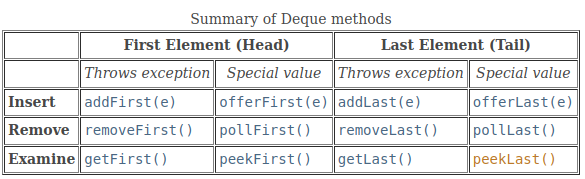
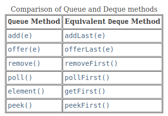
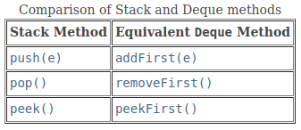

# 3. Deque

### Overview

- The name deque (pronounced "deck") is short for double‐ended queue, which means that it is a data structure that allows insertions and removals from both ends (front and rear).

### Interface `java.util.Deque<E>`

| **`Modifier and Type`** | **`Method`**                      | **Description**                                              |
| ----------------------- | --------------------------------- | ------------------------------------------------------------ |
| `boolean`               | `add(E e)`                        | Inserts the specified element into the queue represented by this deque (at the tail) if space is available, throws IllegalStateException if no space is available. |
| `void`                  | `addFirst(E e)`                   | Inserts the specified element at the front of this deque, throws IllegalStateException if no space is available. |
| `void`                  | `addLast(E e)`                    | Inserts the specified element at the end of this deque, throws IllegalStateException if no space is available. |
| `boolean`               | `offer(E e)`                      | Inserts the specified element into the queue represented by this deque (at the tail) if space is available, returns true upon success, false if no space is available. |
| `boolean`               | `offerFirst(E e)`                 | Inserts the specified element at the front of this deque unless it would violate capacity restrictions. |
| `boolean`               | `offerLast(E e)`                  | Inserts the specified element at the end of this deque unless it would violate capacity restrictions. |
| `E`                     | `poll()`                          | Retrieves and removes the head of the queue represented by this deque, returns null if this deque is empty. |
| `E`                     | `pollFirst()`                     | Retrieves and removes the first element of this deque, returns null if this deque is empty. |
| `E`                     | `pollLast()`                      | Retrieves and removes the last element of this deque, returns null if this deque is empty. |
| `E`                     | `remove()`                        | Retrieves and removes the head of the queue represented by this deque. |
| `E`                     | `removeFirst()`                   | Retrieves and removes the first element of this deque.       |
| `E`                     | `removeLast()`                    | Retrieves and removes the last element of this deque.        |
| `E`                     | `peek()`                          | Retrieves, but does not remove, the head of the queue represented by this deque, returns null if this deque is empty. |
| `E`                     | `peekFirst()`                     | Retrieves, but does not remove, the first element of this deque, returns null if this deque is empty. |
| `E`                     | `peekLast()`                      | Retrieves, but does not remove, the last element of this deque, returns null if this deque is empty. |
| `E`                     | `element()`                       | Retrieves, but does not remove, the head of the queue represented by this deque. |
| `E`                     | `getFirst()`                      | Retrieves, but does not remove, the first element of this deque. |
| `E`                     | `getLast()`                       | Retrieves, but does not remove, the last element of this deque. |
| `boolean`               | `removeFirstOccurrence(Object o)` | Removes the first occurrence of the specified element from this deque. |
| `boolean`               | `removeLastOccurrence(Object o)`  | Removes the last occurrence of the specified element from this deque. |
| `int`                   | `size()`                          | Returns the number of elements in this deque.                |
| `Iterator<E>`           | `iterator()`                      | Returns an iterator over the elements in this deque in proper sequence. |
| `Iterator<E>`           | `descendingIterator()`            | Returns an iterator over the elements in this deque in reverse sequential order. |
| `boolean`               | `contains(Object o)`              | Returns true if this deque contains the specified element.   |
| `void`                  | `push(E e)`                       | Pushes an element onto the stack represented by this deque (at the head) if space is available, throws IllegalStateException if no space is available. |
| `E`                     | `pop()`                           | Pops an element from the stack represented by this deque.    |
| `boolean`               | `remove(Object o)`                | Removes the first occurrence of the specified element from this deque. |

### Implementation

- The Java Collections Framework provides four implementations of the Deque interface, including **ArrayDeque** and **LinkedList**.
    - ArrayDeque utilizes a **resizable circular array** like our class **ArrayQueue** and is the **recommended** implementation because, unlike **LinkedList, it does not support indexed operations.**

### Using a Deque as a Queue

### Using a Deque as a Stack

