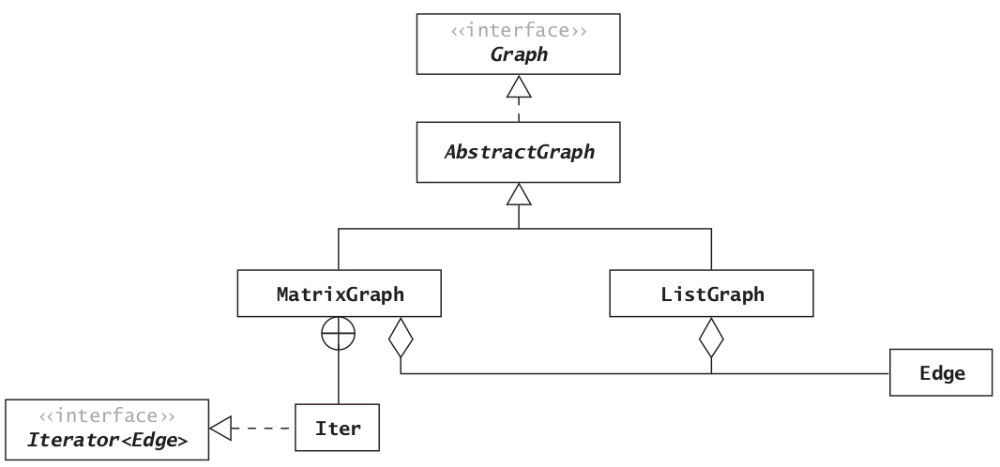

# Graphs

## Graph Terminology

- A graph `G(V, E)` is a data structure that consists of a set of **vertices** (or nodes) and a set of **edges** (relations) between the pairs of vertices.


### Directed and Undirected Graphs

- `Directed Edges`: The edges of a graph are directed if the existence of an edge from A to B does not necessarily guarantee that there is a path in both directions. 
- `Directed Graph`: A graph that contains directed edges is known as a **directed graph** or **digraph**.
- `Undirected Graph`: A graph that contains undirected edges is known as an undirected graph or simply a graph.
- `Weighted Edges`: The edges in a graph may have values associated with them known as their **weights**.
- `Weighted Graph`: A graph with weighted edges is known as **weighted graph**.


### Paths and Cycles

- `Adjacent Vertex`: A vertex is adjacent to another vertex if there is an edge to it from that other vertex.
  - Note that in the case of **directed graph**, adjacency is not necessarily associative, i.e. if A is adjacent to B, it doesn't necessarily mean that B is adjacent to A (if there is no edge from B to A). 
- `Path`: A sequence of vertices in which each successive vertex is adjacent to its predecessor.
- `Simple Path`: In a simple path, the vertices and edges are distinct, except that the first and last vertices may be the same.
- `Cycle`: A cycle is a simple path in which only the first and final vertices are the same. A cycle must contain at least three distinct vertices.
- `Connected Graph`: An undirected graph is called a connected graph if there is a path from every vertex to every other vertex.
  - If a graph is not connected, it is considered **unconnected**, but it will still consist of connected components.


## The Graph ADT and `Edge` Class

- `Java` does not provide a **Graph ADT**.
- We can represent the vertices by integers from 0 up to, but not including, **|V|**. (**|V|** means the cardinality of V, or the number of vertices in set V.) 
- For edges we will define the class Edge that will contain the source vertex, the destination vertex, and the weight.
- For unweighted edges we will use the default value of 1.0.
- Observe that an Edge is directed. For undirected graphs, we will always have two Edge objects: one in each direction for each pair of vertices that has an edge between them. 
- A vertex is represented by a type int variable.

| Data Field              | Attribute                          |
| ----------------------- | ---------------------------------- |
| `private int dest`      | The destination vertex for an edge |
| `private int source`    | The source vertex for an edge      |
| `private double weight` | The weight                         |

| Constructor                                   | Purpose                                                      |
| --------------------------------------------- | ------------------------------------------------------------ |
| `public Edge(int source, int dest)`           | Constructs an Edge from source to dest. Sets the weight to 1.0 |
| `public Edge(int source, int dest, double w)` | Constructs an Edge from source to dest. Sets the weight to w |

| Method                            | Behavior                                                     |
| --------------------------------- | ------------------------------------------------------------ |
| `public boolean equals(Object o)` | Compares two edges for equality. Edges are equal if their source and destination vertices are the same. The weight is not considered |
| `public int getDest()`            | Returns the destination vertex                               |
| `public int getSource()`          | Returns the source vertex                                    |
| `public double getWeight()`       | Returns the weight                                           |
| `public int hashCode()`           | Returns the hash code for an edge. The hash code depends only on the source and destination |
| `public String toString()`        | Returns a string representation of the edge                  |


## Implementing the Graph ADT

- Two representations of graphs are most common:
  - `Adjacency List`: Edges are represented by an array of lists called `adjacency lists`, where each list stores the vertices adjacent to a particular vertex.
  - `Adjacency Matrix`: Edges are represented by a two‐dimensional array, called an `adjacency matrix`, with |V|rows and |V| columns.


### Adjacency List

- An adjacency list representation of a graph uses an array of lists. There is one list for each vertex.
- The vertices are in no particular order.
- The `Edge` must be stored (not just the destination) because weighted graphs can have different values for weights.
- For an undirected graph (or simply a “graph”), symmetric entries are required.


### Adjacency Matrix

- The adjacency matrix uses a two‐dimensional array to represent the graph. 
- For an unweighted graph, the entries in this matrix can be **boolean** values, where true represents the presence of an edge and false its absence. Another popular method is to use the value 1 for an edge and 0 for no edge. The **integer** coding has benefits over the boolean approach for some graph algorithms that use matrix multiplication.
- For a weighted graph, the matrix would contain the weights. Since 0 is a valid weight, we will use `Double.POSITIVE_INFINITY` (a special double value in Java that approximates the mathematical behavior of infinity) to indicate the absence of an edge, and in an unweighted graph we will use a weight of 1.0 to indicate the presence of an edge.
- If the graph is undirected, then the matrix is symmetric, and only the lower diagonal of the matrix needs be saved.


### Overview of the Hierarchy



### Class `AbstractGraph`

| Data Field                 | Attribute                        |
| -------------------------- | -------------------------------- |
| `private boolean directed` | True if this is a directed graph |
| `private int numV`         | The number of vertices           |

| Constructor                                        | Purpose                                                      |
| -------------------------------------------------- | ------------------------------------------------------------ |
| `public AbstractGraph(int numV, boolean directed)` | Constructs an empty graph with the specified number of vertices and with the specified directed flag. If directed is true, this is a directed graph |

| Method                                                       | Behavior                                                     |
| ------------------------------------------------------------ | ------------------------------------------------------------ |
| `public int getNumV()`                                       | Gets the number of vertices                                  |
| `public boolean isDirected()`                                | Returns true if the graph is a directed graph                |
| `public void loadEdgesFromFile(Scanner scan)`                | Loads edges from a data file                                 |
| `public static Graph createGraph(Scanner scan, boolean isDirected, String type)` | Factory method to create a graph and load the data from an input file |

#### Implementation

```java
package datastructures.graph;

import java.util.*;
import java.io.*;
/** Abstract base class for graphs. A graph is a set of vertices and
 a set of edges. Vertices are represented by integers
 from 0 to n ‐ 1. Edges are ordered pairs of vertices.
 */
public abstract class AbstractGraph implements Graph {
// Data Fields
    /**
     * The number of vertices
     */
    private int numV;
    /**
     * Flag to indicate whether this is a directed graph
     */
    private boolean directed;

    // Constructor

    /**
     * Construct a graph with the specified number of vertices and the directed
     * flag. If the directed flag is true, this is a directed graph.
     *
     * @param numV     The number of vertices
     * @param directed The directed flag
     */
    public AbstractGraph(int numV, boolean directed) {
        this.numV = numV;
        this.directed = directed;
    }

    // Accessor Methods

    /**
     * Return the number of vertices.
     *
     * @return The number of vertices
     */
    public int getNumV() {
        return numV;
    }

    /**
     * Return whether this is a directed graph.
     *
     * @return true if this is a directed graph
     */
    public boolean isDirected() {
        return directed;
    }

    // Other Methods

    /**
     * Load the edges of a graph from the data in an input file. The file
     * should contain a series of lines, each line with two or
     * three data values. The first is the source, the second is
     * the destination, and the optional third is the weight.
     *
     * @param scan The Scanner connected to the data file
     */
    public void loadEdgesFromFile(Scanner scan) {
        while (scan.hasNextLine()) {
            String line = scan.nextLine().trim();
            if (line.isEmpty()) continue; // Skip empty lines

            String[] tokens = line.split("\\s+");
            if (tokens.length < 2 || tokens.length > 3) {
                throw new IllegalArgumentException("Invalid edge format: " + line);
            }

            try {
                int source = Integer.parseInt(tokens[0]);
                int dest = Integer.parseInt(tokens[1]);
                double weight = (tokens.length == 3) ? Double.parseDouble(tokens[2]) : 1.0;

                // Add edge to the graph
                insert(new Edge(source, dest, weight));

            } catch (NumberFormatException e) {
                throw new IllegalArgumentException("Invalid number format in line: " + line, e);
            }
        }
    }

    /**
     * Factory method to create a graph and load the data from an input
     * file. The first line of the input file should contain the number
     * of vertices. The remaining lines should contain the edge data as
     * described under loadEdgesFromFile.
     *
     * @param scan       The Scanner connected to the data file
     * @param isDirected true if this is a directed graph,
     *                   false otherwise
     * @param type       The string "Matrix" if an adjacency matrix is to be
     *                   created, and the string "List" if an adjacency list
     *                   is to be created
     * @throws IllegalArgumentException if type is neither "Matrix"
     *                                  nor "List"
     */
    public static Graph createGraph(Scanner scan, boolean isDirected,
                                    String type) {
        int numV = scan.nextInt();
        AbstractGraph returnValue;
        type = type.toLowerCase();
        switch (type) {
            case "matrix":
                returnValue = new MatrixGraph(numV, isDirected);
                break;
            case "list":
                returnValue = new ListGraph(numV, isDirected);
                break;
            default:
                throw new IllegalArgumentException();
        }
        returnValue.loadEdgesFromFile(scan);
        return returnValue;
    }
}
```


### The `ListGraph` Class

| Data Field                   | Attribute                                                    |
| ---------------------------- | ------------------------------------------------------------ |
| `private List<Edge>[] edges` | An array of Lists to contain the edges that originate with each vertex |

| Constructor                                    | Purpose                                                      |
| ---------------------------------------------- | ------------------------------------------------------------ |
| `public ListGraph(int numV, boolean directed)` | Constructs a graph with the specified number of vertices and directionality |

| Method                                           | Behavior                                                     |
| ------------------------------------------------ | ------------------------------------------------------------ |
| `public Iterator<Edge> edgeIterator(int source)` | Returns an iterator to the edges that originate from a given vertex |
| `public Edge getEdge(int source, int dest)`      | Gets the edge between two vertices                           |
| `public void insert(Edge e)`                     | Inserts a new edge into the graph                            |
| `public boolean isEdge(int source, int dest)`    | Determines if there is an edge between the given vertices    |


#### Implementation

```java
package datastructures.graph;

import java.util.*;

/** A ListGraph is an extension of the AbstractGraph abstract class
 that uses an array of lists to represent the edges.
 */
public class ListGraph extends AbstractGraph {
    // Data Field
    /**
     * An array of Lists to contain the edges that
     * originate with each vertex.
     */
    private List<Edge>[] edges;

    /**
     * Construct a graph with the specified number of vertices and directionality.
     *
     * @param numV     The number of vertices
     * @param directed The directionality flag
     */
    public ListGraph(int numV, boolean directed) {
        super(numV, directed);
        edges = new List[numV];
        for (int i = 0; i < numV; i++) {
            edges[i] = new LinkedList<Edge>();
        }
    }

    /**
     * Insert a new edge into the graph.
     *
     * @param edge The new edge
     */
    public void insert(Edge edge) {
        edges[edge.getSource()].add(edge);
        if (!isDirected()) {
            edges[edge.getDest()].add(new Edge(edge.getDest(), edge.getSource(),
                    edge.getWeight()));
        }
    }

    /**
     * Get the edge between two vertices.
     *
     * @param source The source
     * @param dest   The destination
     * @return the edge between these two vertices
     * or null if an edge does not exist.
     */
    public Edge getEdge(int source, int dest) {
        Edge target = new Edge(source, dest, Double.POSITIVE_INFINITY);
        for (Edge edge : edges[source]) {
            if (edge.equals(target))
                return edge; // Desired edge found, return it.
        }
        // Assert: All edges for source checked.
        return null; // Desired edge not found.
    }
    
    /**
     * Determine whether an edge exists.
     *
     * @param source The source vertex
     * @param dest   The destination vertex
     * @return true if there is an edge from source to dest
     */
    public boolean isEdge(int source, int dest) {
        return edges[source].contains(new Edge(source, dest));
    }

    public Iterator<Edge> edgeIterator(int source) {
        return edges[source].iterator();
    }

}
```


### The `MatrixGraph` Class

```java
package datastructures.graph;

import java.util.ArrayList;
import java.util.Iterator;
import java.util.LinkedList;
import java.util.List;

public class MatrixGraph extends AbstractGraph{

    private double[][] edges;

    public MatrixGraph(int numV, boolean isDirected) {
        super(numV, isDirected);
        edges = new double[numV][numV];
        for (int i = 0; i < numV; i++) {
            for (int j = 0; j < numV; j++) {
                edges[i][j] = Double.POSITIVE_INFINITY;
            }
        }
    }

    @Override
    public void insert(Edge edge) {
        edges[edge.getSource()][edge.getDest()] = edge.getWeight();
        if(!isDirected()){
            edges[edge.getDest()][edge.getSource()] = edge.getWeight();
        }
    }

    @Override
    public boolean isEdge(int source, int dest) {
        return edges[source][dest] != Double.POSITIVE_INFINITY;
    }

    @Override
    public Edge getEdge(int source, int dest) {
        return edges[source][dest] == Double.POSITIVE_INFINITY ? null : new Edge(source, dest);
    }

    @Override
    public Iterator<Edge> edgeIterator(int source) {
        List<Edge> edges = new LinkedList<>();
        for(int i = 0; i < this.getNumV(); i++){
            if(this.edges[source][i] != Double.POSITIVE_INFINITY){
                edges.add(getEdge(source, i));
            }
        }
        return edges.iterator();
    }
}
```


### Complexity Analysis

- The density of a graph is the ratio of $|E|$ to $|V|^2$.
  - A dense graph is one in which $|E|$ is close to but less than $|V|^2$.

#### Time Efficiency

- Many graph algorithms are of the form:

  ```java
  1. for each vertex u in the graph
  2. for each vertex v adjacent to u
  3.     Do something with edge (u, v).
  ```

  - Adjacency List: $O(|E|)$.
  - Adjacency Matrix: $O(|V|^2)$.
  - Thus, for a sparse graph, the adjacency list gives better performance for this type of algorithm.

- Some graph are of the form:

  ```java
  1. for each vertex u in some subset of the vertices
  2. for each vertex v in some subset of the vertices
  3.     if (u, v) is an edge
  4.         Do something with edge (u, v).
  ```

  - Adjacency List: $O(|V||E|)$.
  - Adjacency Matrix: $O(|V|^2)$. Since the search step is $O(1)$.
  - Thus, for a dense graph, the adjacency matrix gives better performance for this type of algorithm.


#### Storage Efficiency

- Adjacency Matrix: $O(|V|^2)$
  - If the graph is sparse, there will be a lot of wasted space in the adjacency matrix.
- On the other hand, in an adjacency list, each edge is represented by a reference to an `Edge` object containing data about the source, destination, and weight as well as a reference to the next edge in the list.
  - Therefore, the adjacency list uses less storage when less than 25 percent of the adjacency matrix would be filled.


### The `MapGraph` Class

- We can achieve the performance benefits of both the `ListGraph` and `MatrixGraph` by making a slight modification to the `ListGraph`. Replacing the array of `List<Edge>` with an array of `Map<Integer, Edge>` allows us to query the existence of an edge in $O(1)$ time, and using the `LinkedHashMap` allows iterating through the edges adjacent to a given vertex in $O(|E_u|)$.

```java
package datastructures.graph;

import java.util.*;

/** A MapGraph is an extension of the AbstractGraph abstract class
 that uses an array of maps to represent the edges.
 */
public class MapGraph extends AbstractGraph {
    // Data Field
    /**
     * An array of maps to contain the edges that
     * originate with each vertex.
     */
    private Map<Integer, Edge>[] outgoingEdges;

    /**
     * Construct a graph with the specified number of vertices and directionality.
     *
     * @param numV     The number of vertices
     * @param directed The directionality flag
     */
    public MapGraph(int numV, boolean directed) {
        super(numV, directed);
        outgoingEdges = new Map[numV];
        for (int i = 0; i < numV; i++) {
            outgoingEdges[i] = new LinkedHashMap<>();
        }
    }

    /**
     * Insert a new edge into the graph.
     *
     * @param edge The new edge
     */
    public void insert(Edge edge) {
        int source = edge.getSource();
        int dest = edge.getDest();
        double weight = edge.getWeight();
        outgoingEdges[source].put(dest, edge);
        if (!isDirected()) {
            Edge reverseEdge = new Edge(dest, source, weight);
            outgoingEdges[dest].put(source, reverseEdge);
        }
    }

    /**
     * Get the edge between two vertices.
     *
     * @param source The source
     * @param dest   The destination
     * @return the edge between these two vertices
     * or null if an edge does not exist.
     */
    public Edge getEdge(int source, int dest) {
        return outgoingEdges[source].get(dest);
    }

    /**
     * Determine whether an edge exists.
     *
     * @param source The source vertex
     * @param dest   The destination vertex
     * @return true if there is an edge from source to dest
     */
    public boolean isEdge(int source, int dest) {
        return outgoingEdges[source].containsKey(dest);
    }

    public Iterator<Edge> edgeIterator(int source) {
        return outgoingEdges[source].values().iterator();
    }

}
```


## Graph Traversals

- The two most common traversal algorithms are **breadth-first** and **depth-first** search.


### Breadth-First Search

```java
1. Take an arbitrary start vertex, mark it visited and place it in a queue.
2. while the queue is not empty
3.     Take a vertex u.
4.     for all vertices, v, adjacent to this vertex, u
5.         if v has not been visited
6.             Mark it visited .
7. 			   Insert vertex v into the queue.
```

**NOTE:** A path starting at the root to any vertex in the tree is the shortest path in the original graph from the start vertex to that vertex, where we consider all edges to have the same weight. Therefore, the shortest path is the one that goes through the smallest number of vertices. We can save the information we need to represent this tree by storing the parent of each vertex when we identify it (Step 7 of the breadth‐first algorithm).

```java
Refinement of Step 7 of Breadth‐First Search Algorithm
7.1 Insert vertex v into the queue.
7.2 Set the parent of v to u.
```

- Time Complexity: $O(|E|)$


```java
package algorithms.graph.search;

import datastructures.graph.Edge;
import datastructures.graph.Graph;

import java.util.Iterator;
import java.util.LinkedList;
import java.util.Queue;

/** Class to implement the breadth‐first search algorithm. */
public class BreadthFirstSearch {

    /** Perform a breadth‐first search of a graph.
     @post The array parent will contain the predecessor
     of each vertex in the breadth‐first search tree.
     @param graph The graph to be searched
     @param start The start vertex
     @return The array of parents
     */
    public static int[] breadthFirstSearch(Graph graph, int start) {
        Queue<Integer> queue = new LinkedList<Integer>();

        // Declare array parent and initialize its elements to –1.
        int[] parent = new int[graph.getNumV()];
        for (int i = 0; i < graph.getNumV(); i++) {
            parent[i] = -1;
        }

        // Declare array visited and initialize its elements to false.
        boolean[] visited = new boolean[graph.getNumV()];

        // Mark the start vertex as visited and insert it into the queue.
        visited[start] = true;
        queue.offer(start);

        // Perform breadth‐first search until done
        while (!queue.isEmpty()) {
            // Take a vertex, current, out of the queue.
            int current = queue.remove();
            System.out.print(current + "\t");
            // Examine each vertex, neighbor, adjacent to current.
            Iterator<Edge> itr = graph.edgeIterator(current);
            while (itr.hasNext()) {
                Edge edge = itr.next();
                int neighbor = edge.getDest();
                if (!visited[neighbor]) {
                    // Mark it visited.
                    visited[neighbor] = true;
                    // Place it into the queue.
                    queue.offer(neighbor);
                    // Insert the edge (current, neighbor) into the tree.
                    parent[neighbor] = current;
                }
            }
        }
        return parent;
    }
}
```


### Depth-First Search

```java
1. Mark the current vertex, u, visited (color it light gray), and enter it in the discovery order list.
2. for each vertex, v, adjacent to the current vertex, u
3.     if v has not been visited
4.         Set parent of v to u.
5.         Recursively apply this algorithm starting at v.
6. Mark u finished (color it dark gray) and enter u into the finish order list.
```

```java
package algorithms.graph.search;

import datastructures.graph.Edge;
import datastructures.graph.Graph;

import java.util.Iterator;
import java.util.LinkedList;
import java.util.Queue;

/** Class to implement the breadth‐first search algorithm. */
public class BreadthFirstSearch {

    /** Perform a breadth‐first search of a graph.
     @post The array parent will contain the predecessor
     of each vertex in the breadth‐first search tree.
     @param graph The graph to be searched
     @param start The start vertex
     @return The array of parents
     */
    public static int[] breadthFirstSearch(Graph graph, int start) {
        Queue<Integer> queue = new LinkedList<Integer>();

        // Declare array parent and initialize its elements to –1.
        int[] parent = new int[graph.getNumV()];
        for (int i = 0; i < graph.getNumV(); i++) {
            parent[i] = -1;
        }

        // Declare array visited and initialize its elements to false.
        boolean[] visited = new boolean[graph.getNumV()];

        // Mark the start vertex as visited and insert it into the queue.
        visited[start] = true;
        queue.offer(start);

        // Perform breadth‐first search until done
        while (!queue.isEmpty()) {
            // Take a vertex, current, out of the queue.
            int current = queue.remove();
            System.out.print(current + "\t");
            // Examine each vertex, neighbor, adjacent to current.
            Iterator<Edge> itr = graph.edgeIterator(current);
            while (itr.hasNext()) {
                Edge edge = itr.next();
                int neighbor = edge.getDest();
                if (!visited[neighbor]) {
                    // Mark it visited.
                    visited[neighbor] = true;
                    // Place it into the queue.
                    queue.offer(neighbor);
                    // Insert the edge (current, neighbor) into the tree.
                    parent[neighbor] = current;
                }
            }
        }
        return parent;
    }
}
```

- Time Complexity: $O(|E|)$. Please note that there is an implicit step 0 of the algorithm to that marks all vertices as unvisited. This is $O(|V|)$, thus, the total running time of the algorithm is $O(|V|+|E|)$.


### Topological Sort

- A topological sort of the vertices of a **DAG (Directed Acyclic Graph)** is an ordering of the vertices such that if $(u, v)$ is an edge, then u appears before v. This must be true for all edges.
- **If there is an edge from u to v in a DAG, then if we perform depth-first search of this graph, the finish time of u must be after the finish time of v.**

```java
Algorithm for Topological Sort
1. Perform a depth‐first search of the graph.
2. List the vertices in reverse of their finish order.
```

```java
package algorithms.graph.sort;

import algorithms.graph.search.DepthFirstSearch;
import datastructures.graph.AbstractGraph;
import datastructures.graph.Graph;

import java.io.File;
import java.util.*;

/** This program outputs the topological sort of a directed graph
 that contains no cycles.
 */
public class TopologicalSort {
    /**
     * The main method that performs the topological sort.
     *
     * @param args The command line arguments
     * @pre arg[0] contains the name of the file
     * that contains the graph. It has no cycles.
     */
    public static void main(String[] args) {
        Graph theGraph = null;
        int numVertices = 0;
        try {
            // Connect Scanner to input file.
            Scanner scan = new Scanner(new File(args[0]));
            // Load the graph data from a file.
            theGraph = AbstractGraph.createGraph(scan, true, "List");
            numVertices = theGraph.getNumV();
        } catch (Exception ex) {
            ex.printStackTrace();
            System.exit(1);
            // Error exit.
        }
        // Perform the depth‐first search.
        DepthFirstSearch.depthFirstSearch(theGraph, 0);

        // Topological Sort is the reverse of finish order in dfs. Please update the print statements in the dfs to view topological sort.
    }
}
```

- **NOTE:** To keep **DepthFirstSearch** class simple, we don't add any data objects for storing discovery and finish orders. One can keep track of finish orders to output topological sort correctly.


## Algorithms Using Weighted Graphs

### Dijkstra's Algorithm

- Used for finding the shortest path from a vertex to all other vertices.
- Assumes that all of the edge values are positive.

- Time Complexity: $O(|V|^2)$

#### Pseudocode

```java
 1  function Dijkstra(Graph, source):
 2     
 3      for each vertex v in Graph.Vertices:
 4          dist[v] ← INFINITY
 5          prev[v] ← UNDEFINED
 6          add v to Q
 7      dist[source] ← 0
 8     
 9      while Q is not empty:
10          u ← vertex in Q with minimum dist[u]
11          remove u from Q
12         
13          for each neighbor v of u still in Q:
14              alt ← dist[u] + Graph.Edges(u, v)
15              if alt < dist[v]:
16                  dist[v] ← alt
17                  prev[v] ← u
18
19      return dist[], prev[]
```


#### Using a Priority Queue

```java
1   function Dijkstra(Graph, source):
2       create vertex priority queue Q
3
4       dist[source] ← 0                          // Initialization
5       Q.add_with_priority(source, 0)            // associated priority equals dist[·]
6
7       for each vertex v in Graph.Vertices:
8           if v ≠ source
9               prev[v] ← UNDEFINED               // Predecessor of v
10              dist[v] ← INFINITY                // Unknown distance from source to v
11              Q.add_with_priority(v, INFINITY)
12
13
14      while Q is not empty:                     // The main loop
15          u ← Q.extract_min()                   // Remove and return best vertex
16          for each neighbor v of u:             // Go through all v neighbors of u
17              alt ← dist[u] + Graph.Edges(u, v)
18              if alt < dist[v]:
19                  prev[v] ← u
20                  dist[v] ← alt
21                  Q.decrease_priority(v, alt)
22
23      return dist, prev
```

#### Implementation

```java
package algorithms.graph.shortestpath;

import datastructures.graph.Graph;

import java.util.HashSet;

public class Dijkstra {

    public static final int UNDEFINED = Integer.MIN_VALUE;
    public static final double INFINITY = Double.POSITIVE_INFINITY;

    /**
     * Dijkstra's Shortest‐Path algorithm.
     *
     * @param graph The weighted graph to be searched
     * @param start The start vertex
     * @param pred  Output array to contain the predecessors in the shortest path
     * @param dist  Output array to contain the distance in the shortest path
     */
    public static void dijkstrasAlgorithm(Graph graph, int start, int[] pred, double[] dist) {
        int numV = graph.getNumV();
        System.out.println(numV);
        HashSet<Integer> vMinusS = new HashSet<>(numV);

        // Initialization.
        for (int v = 0; v < numV; v++) {
            dist[v] = INFINITY;
            pred[v] = UNDEFINED;
            vMinusS.add(v);
        }

        dist[start] = 0;

        // Main loop
        while (!vMinusS.isEmpty()) {
            // Find the value u in V–S with the smallest dist[u].
            double minDist = INFINITY;
            int u = UNDEFINED;

            for (int v : vMinusS) {
                if (dist[v] < minDist) {
                    minDist = dist[v];
                    u = v;
                }
            }

            // Remove u from vMinusS
            vMinusS.remove(u);

            // Update the distances.
            for (int v : vMinusS) {
                if (graph.isEdge(u, v)) {
                    double weight = graph.getEdge(u, v).getWeight();
                    if (dist[u] + weight < dist[v]) {
                        dist[v] = dist[u] + weight;
                        pred[v] = u;
                    }
                }
            }
        }
    }
}
```


### Minimum Spanning Trees

- A spanning tree is a subset of the edges of a graph such that there is only one edge between each vertex, and all of the vertices are connected. 
- If we have a spanning tree for a graph, then we can access all the vertices of the graph from the start node. 
- The cost of a spanning tree is the sum of the weights of the edges. We want to find the **minimum** spanning tree or the spanning tree with the smallest cost.
- Two algorithms for finding **Minimum Spanning Trees:**
  - Prim's Algorithm
  - Kruskal Algorithm


#### Prim's Algorithm

- The algorithm may informally be described as performing the following steps:
  1. Initialize a tree with a single vertex, chosen arbitrarily from the graph.
  2. Grow the tree by one edge: Of the edges that connect the tree to vertices not yet in the tree, find the minimum-weight edge, and transfer it to the tree.
  3. Repeat step 2 (until all vertices are in the tree).

```java
Initialize S with the start vertex, s, and V–S with the remaining vertices.
for all v in V–S
	Set p[v] to s.
	if there is an edge (s, v)
		Set d[v] to w(s, v).
	else
		Set d[v] to ∞.
while V–S is not empty
	for all u in V–S, find the smallest d[u].
	Remove u from V–S and add it to S.
	Insert the edge (u, p[u]) into the spanning tree.
	for all v in V–S
		if w(u, v) < d[v]
            Set d[v] to w(u, v).
            Set p[v] to u.
```

- Time Complexity: $O(|V|^2)$

##### Implementation

```java
package algorithms.graph.minspanningtree;

import datastructures.graph.Edge;
import datastructures.graph.Graph;

import java.util.*;

public class Prim {

    /** Prim's Minimum Spanning Tree algorithm.
     @param graph The weighted graph to be searched
     @param start The start vertex
     @return An ArrayList of edges that forms the MST
     */
    public static ArrayList<Edge> primsAlgorithm(Graph graph, int start) {
        ArrayList<Edge> result = new ArrayList<>();
        int numV = graph.getNumV();

        // Use a HashSet to represent V–S.
        Set<Integer> vMinusS = new HashSet<>(numV);
        // Declare the priority queue.
        Queue<Edge> pQ = new PriorityQueue<>(numV, (e1, e2) -> Double.compare(e1.getWeight(), e2.getWeight()));

        // Initialize V–S.
        for (int i = 0; i < numV; i++) {
            if (i != start) {
                vMinusS.add(i);
            }
        }
        int current = start;
        // Main loop
        while (!vMinusS.isEmpty()) {
            // Update priority queue.
            Iterator<Edge> iter = graph.edgeIterator(current);
            while (iter.hasNext()) {
                Edge edge = iter.next();
                int dest = edge.getDest();
                if (vMinusS.contains(dest)) {
                    pQ.add(edge);
                }
            }
            // Find the shortest edge whose source is in S and
            // destination is in V–S.
            int dest = -1;
            Edge edge = null;
            do {
                edge = pQ.remove();
                dest = edge.getDest();
            } while(!vMinusS.contains(dest));
            // Take dest out of vMinusS.
            vMinusS.remove(dest);
            // Add edge to result.
            result.add(edge);
            // Make this the current vertex.
            current = dest;
        }
        return result;
    }
}
```


#### Kruskal's Algorithm

```java
Algorithm Kruskal(G):
Input: A simple connected weighted graph G with n vertices and m edges
Output: A minimum spanning tree T for G

for each vertex v in G do
	Define an elementary cluster C(v) = {v}.
Initialize a priority queue Q to contain all edges in G, using the weights as keys.
T =∅
{T will ultimately contain the edges of an MST}
while T has fewer than n − 1 edges do
	(u, v) = value returned by Q.removeMin( )
	Let C(u) be the cluster containing u, and let C(v) be the cluster containing v.
	if C(u) not equal to C(v) then
		Add edge (u, v) to T .
		Merge C(u) and C(v) into one cluster.
return tree T
```

- **NOTE: Prim's algorithm is better for denser graphs since it iterates over vertices, however Kruskal's algorithm is better for sparser graphs since it iterates over edges.**
